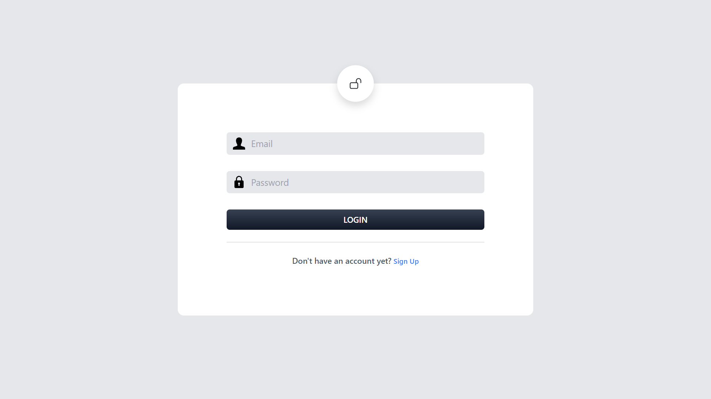

# Job Tracker Web App
Disclaimer: This project is still under development. Some features mentioned herein are yet to be accessible or available.

## Overview

The Job Tracker Web App is designed to help job seekers efficiently manage and track their job applications. It allows users to customize tracking fields, integrate with Google Calendar for reminders, store resumes securely on Google Cloud, and receive notifications via in-app or email. The app is built using the MERN stack and provides a user-friendly interface for both desktop and mobile devices.

## Features

- **Customizable Tracking Fields**: Tailor the app to your specific needs by adding custom fields such as job posting URLs, tailored resumes, and follow-up reminders.
- **Google Calendar Integration**: Set reminders for important dates like application deadlines, interview schedules, and follow-up tasks.
- **Advanced Sorting and Filtering**: Organize applications by status, job type, company name, or date.
- **Secure Resume Storage**: Upload, store, and access resumes securely on Google Cloud.
- **Personalized Notifications**: Receive timely alerts via app or email for upcoming interviews, deadlines, and tasks.
- **Data Analytics**: Track application success rates and gain insights to improve your job search strategy.
- **Cross-Platform Accessibility**: Access the app from various devices and operating systems.
- **Collaboration Features**: Share your job tracking progress with mentors or career coaches for feedback and support.

## Technology Stack

- **Frontend**: React.js, HTML, Tailwind CSS, JavaScript
- **Backend**: Node.js, Express.js
- **Database**: MongoDB
- **Cloud Storage**: Google Cloud
- **Notifications**: Twilio API
- **Calendar Integration**: Google Calendar API

## Installation

### Prerequisites

- Node.js and npm installed
- MongoDB installed or access to a MongoDB cloud instance
- Google Cloud account for storing resumes
- Twilio account for sending notifications

### Steps

1. **Clone the repository:**

    ```sh
    git clone https://github.com/your-username/job-tracker-web-app.git
    cd job-tracker-web-app
    ```

2. **Install dependencies:**

    ```sh
    npm install
    ```

3.  **Set up Google Cloud Storage:**

    Create new project, VM instance, service account and bucket storage. From service accounts, create and download private key (JSON key).

4. **Base64 Encode JSON Key:**
    Run this command in the directory where JSON key is located.
   ```
    cat key.json | base64

    ```
    Copy the base64-encoded string to `.env` file.
    
6.  **Set up environment variables:**

    Create a `.env` file in the root directory and add the following variables:

    ```env
    PORT=8080
    DBURL=your_mongodb_url
    JWT_SECRET=your_jwt_secret_key
    GOOGLE_PROJECT_ID=your_project_id_on_google_cloud
    GOOGLE_SERVICE_KEY=base64_encoded_string
    
    ```

7. **Run the application:**

    ```sh
    npm start
    ```

8. **Access the app:**

    Open your browser and navigate to `http://localhost:8080`.

## Usage/Screen

1. **Homepage:**
   Homepage comes with light and dark mode toggle and the option to register or log in.

   
   
   
   
2. **Sign Up / Log In:**
   Create a new account or log in with your existing credentials.

   
   
   
   
3. **Dashboard:**
   The dashboard presents the statistics of total jobs applied and applications pending, declined and scheduled for interview.
   
   
   
4. **Add Job Applications:**
   Input your job applications manually, customizing the fields as needed.

    

5. **Upload Resumes:**
   Upload and store your resumes securely on Google Cloud storage using bucket.

6. **Track Progress:**
   Use advanced sorting and filtering options to manage your applications.
    

7. **User Profile:**
   Manage user information, such as, avatar, name and email.
   
   
8. **Set Reminders:** 
   Integrate with Google Calendar to set reminders for important dates. (pending feature)

9. **Receive Notifications:** 
   Enable SMS or email notifications for reminders and updates. (pending feature)

## Contributing

We welcome contributions to enhance the Job Tracker Web App. To contribute, please fork the repository, create a new branch for your feature or bugfix, and submit a pull request with a detailed description of your changes.

## License

This project is licensed under the MIT License.

## Contact

For any questions or feedback, please contact me at md.ameynuddin@gmail.com.

---

Feel free to adjust the content to match the specifics of your project and personal preferences.
